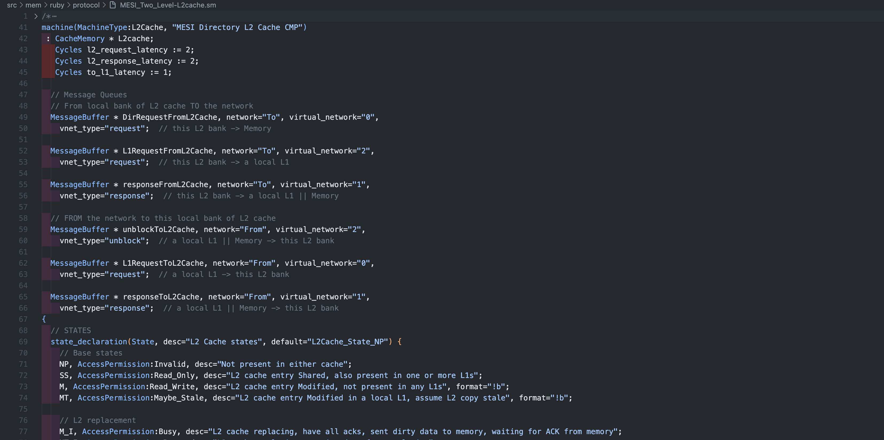

# gem5-slicc README

gem5-slicc supportor

## Features

- syntax highlight support

## Requirements

gem5 slicc code

## Extension Settings

## Known Issues

---

## For more information

* [Visual Studio Code's Markdown Support](http://code.visualstudio.com/docs/languages/markdown)
* [Markdown Syntax Reference](https://help.github.com/articles/markdown-basics/)

**Enjoy!**
