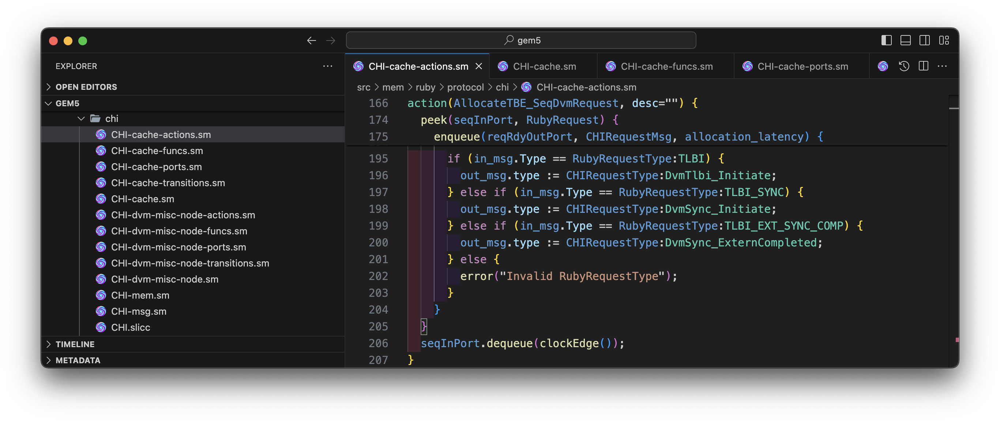
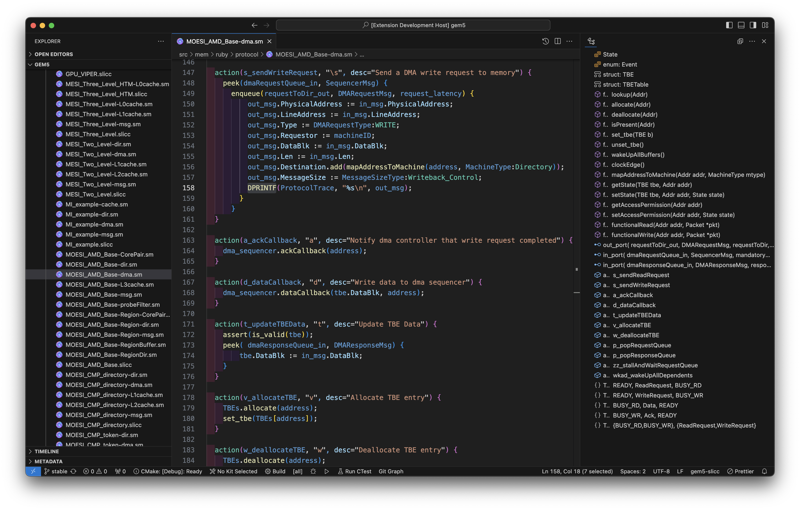
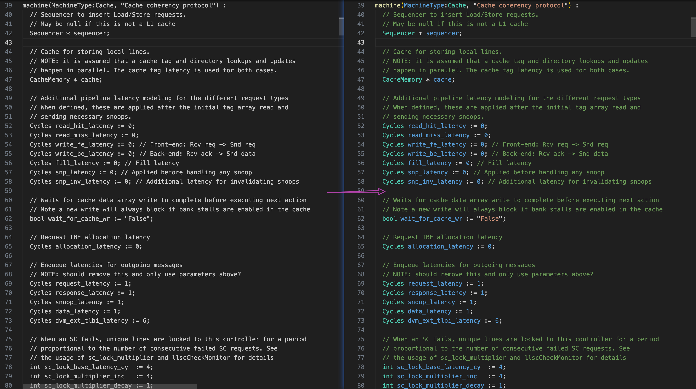
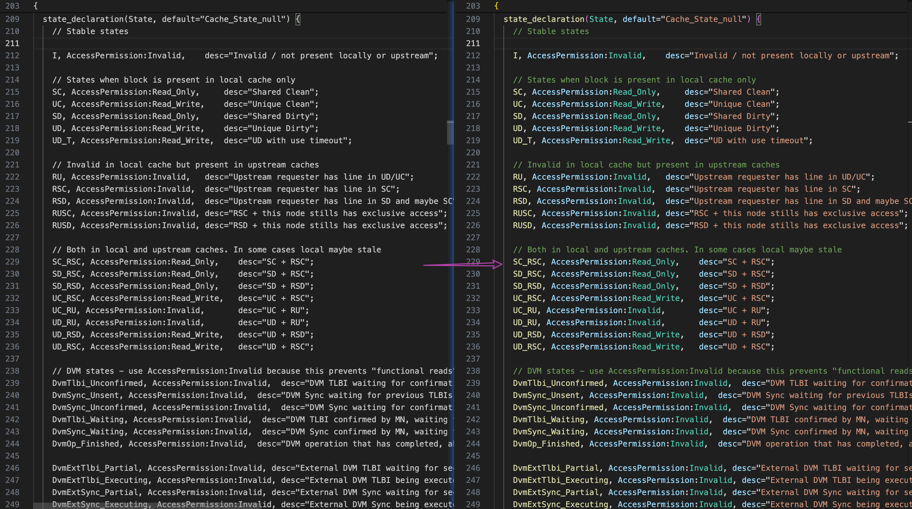
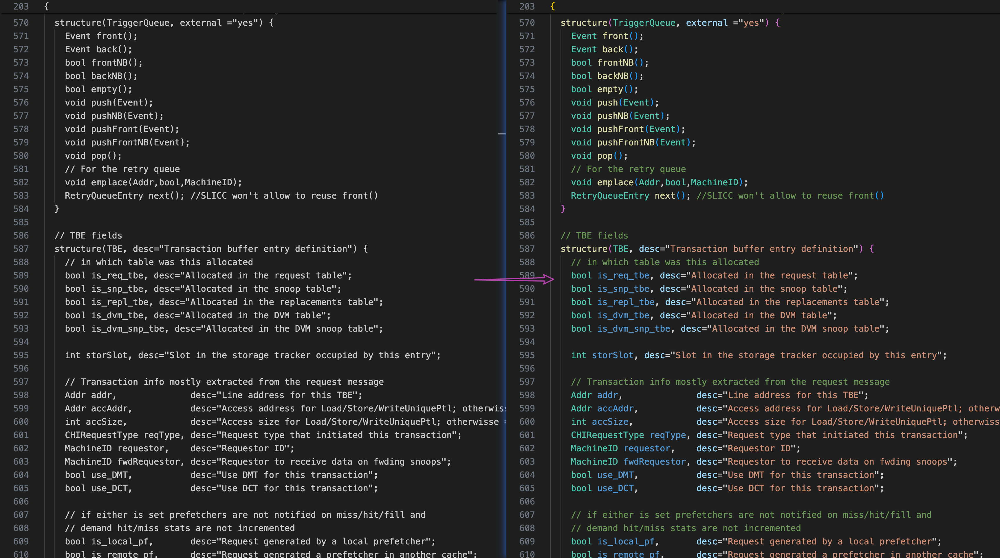
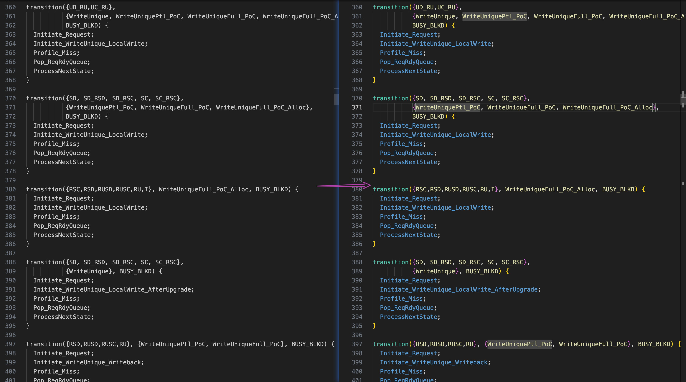
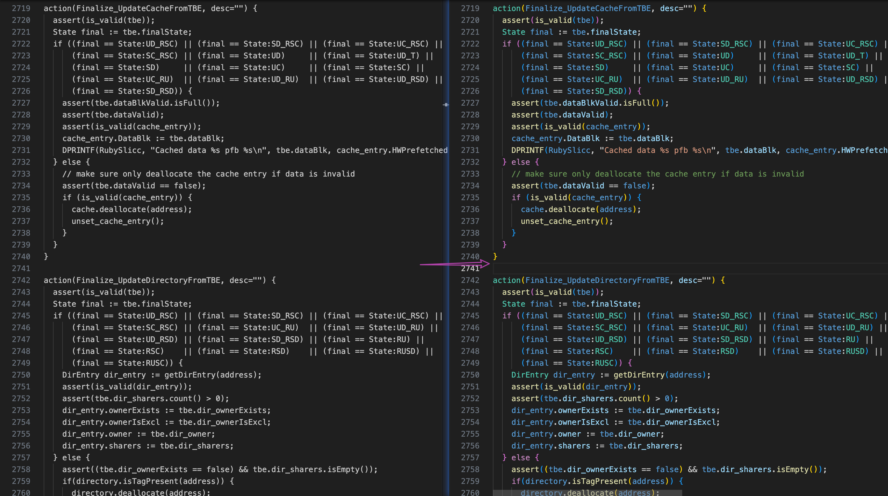
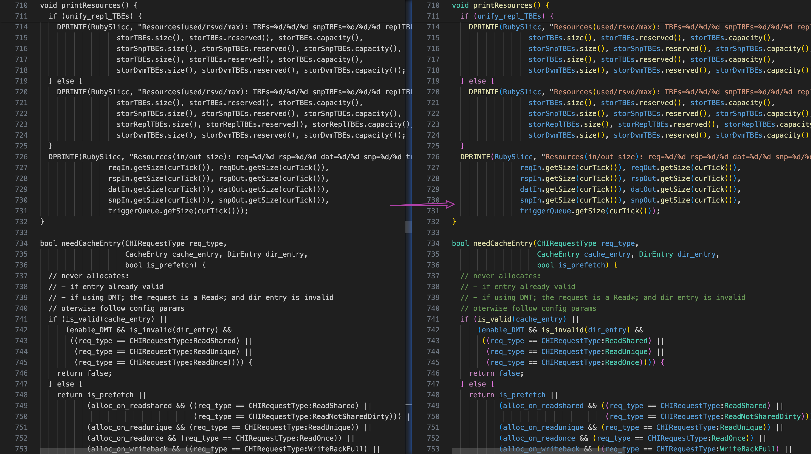

# gem5-slicc README

gem5-slicc supportor

## Features

### file icon

### outline

### syntax highlight support

- [x] variable

---

- [x] state/event

---

- [x] struct

---

- [x] transition

---

- [x] action

---

- [x] function

## Requirements

gem5 slicc code

## Extension Settings

recommend color theme: **Dark Modern**, **GitHub Dark Default**

## Known Issues

---

## For more information

* [Visual Studio Code's Markdown Support](http://code.visualstudio.com/docs/languages/markdown)
* [Markdown Syntax Reference](https://help.github.com/articles/markdown-basics/)

**Enjoy!**
